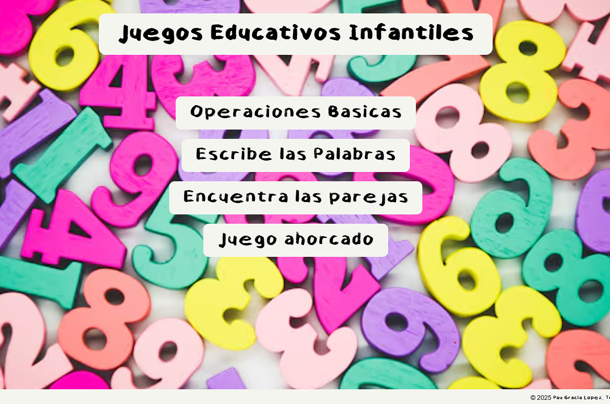

# 🌐 Web Juegos Infantiles  

**Repositorio:** `web-juegos-infantiles`  
**Autor:** Pau Gracia  


  

---

## 📖 Descripción  

**Web Juegos Infantiles** es una colección de juegos educativos web desarrollada con **HTML, CSS y JavaScript puro**.  
Está orientada a niños y niñas para aprender **matemáticas** y **vocabulario** de manera interactiva y divertida.  

Actualmente incluye:  
- 🧠 **Memori** → Juego de memoria visual con imágenes y puntuación.  
- ➕ **Operaciones** → Practica operaciones matemáticas (niveles fáciles y avanzados).  
- 🔤 **Juego de Palabras** → Aprende vocabulario en distintos idiomas con casillas de letras.  

👉 Funciona en **navegadores modernos** y es compatible con **Windows** y **Linux**.  
👉 Optimizado para una experiencia fluida en **móvil y escritorio**.  

---

## 🛠️ Tecnologías  

- **HTML5**  
- **CSS3** (Flexbox, media queries)  
- **JavaScript (Vanilla JS)**  
- **PHP** (backend mínimo para almacenamiento de puntuaciones `guardar.php`)  
- **Git** (control de versiones, despliegue seguro vía SSH)  

---

## ✨ Características  

- Modal de configuración para seleccionar nivel, número de operaciones o cantidad de palabras.  
- Diferentes niveles de dificultad en juegos matemáticos.  
- Validación en tiempo real de respuestas y feedback visual:  
  - ✅ Verde = correcto  
  - ❌ Rojo = incorrecto  
- **Responsive design** (adaptativo a móviles).  
- Persistencia de puntuaciones y ranking en memoria backend (`memori.txt`).  
- Navegación sencilla y segura entre juegos.  

---

## 🚀 Instalación y uso

Este proyecto utiliza **PHP** para guardar las puntuaciones en el ranking del juego de parejas.  
Por ello, es necesario **clonar el repositorio** y **levantar un servidor local** para que funcione correctamente.  

### 1️⃣ Clonar el repositorio

Usando **SSH**:

git clone git@github.com:PauGracia/web-juegos-infantiles.git
cd web-juegos-infantiles
O usando HTTPS:

## 2️⃣ Levantar un servidor local con PHP

Asegúrate de tener PHP instalado (Windows, Linux o macOS).  
Luego ejecuta en la terminal:

```bash
php -S localhost:8000

## 3️⃣ Abrir en el navegador

👉 [http://localhost:8000](http://localhost:8000)

⚠️ **Nota:** El ranking solo funciona con servidor PHP.  
Si no lo levantas, el juego cargará pero sin la opción de guardar puntuaciones.

## 🔎 Ver el proyecto sin ranking

También puedes probar el juego sin ranking en GitHub Pages:

👉 [https://paugracia.github.io/web-juegos-infantiles/index.html](https://paugracia.github.io/web-juegos-infantiles/index.html)


## 📊 Esquema de uso

🖥️ Clonar repositorio
│
▼
📂 Entrar en carpeta del proyecto
│
▼
⚙️ Levantar servidor local con PHP
│
▼
🌐 Abrir http://localhost:8000
│
├── ✅ Con servidor PHP → Juego + Ranking
│
└── ❌ Sin servidor PHP → Acceso a GitHub Pages
👉 https://paugracia.github.io/web-juegos-infantiles/index.html


## 📂 Estructura de carpetas

```
web-juegos-infantiles/
│
├─ backend/         # Archivos PHP y datos
│  └─ data/memori.txt
├─ css/             # Estilos
├─ js/              # Scripts JS (todos los juegos en un solo archivo)
├─ index.html       # Página principal
├─ memoria.html     # Juego Memori
├─ operaciones.html # Juego Operaciones
├─ palabras.html    # Juego de palabras
└─ README.md        # Documentación
```


## ⚙️ Configuración especial  

- **Compatibilidad Windows/Linux** → `core.autocrlf=input` en Git para evitar problemas de fin de línea.  
- **SSH en GitHub** → conexión remota con clave SSH para evitar errores 403.  
- **Operaciones** → en nivel avanzado (nivel 2) se deshabilita el input del máximo operando.  
- **Palabras** → el juego congela la palabra a adivinar, validando letra a letra con feedback en tiempo real.  

---

## 🔮 Mejoras futuras  

- Sonido y animaciones para feedback positivo/negativo.  
- Guardado de progreso de usuarios entre sesiones.  
- Inclusión de más idiomas y palabras para el juego de vocabulario.  
- Optimización de backend para ranking global multiusuario.  

---

## 📜 Licencia  

Proyecto personal desarrollado con fines **educativos** y de **demostración** para currículum y portfolio.  


